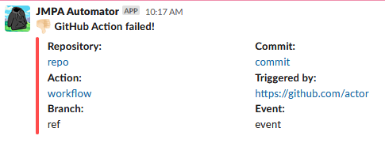

[](https://github.com/jmpa-oss/job-to-slack/actions?query=workflow%3Acicd)
[](https://github.com/jmpa-oss/job-to-slack/actions?query=workflow%3Aupdate)

# job-to-slack

<p align="center">
  
</p>

```diff
+ A GitHub Action for posting the result of a GitHub Action job to a Slack channel,
+ via a given webhook.
```
* Inspired by https://github.com/8398a7/action-slack
* To learn about creating a custom GitHub Action like this, see [this doc](https://docs.github.com/en/free-pro-team@latest/actions/creating-actions/creating-a-docker-container-action).


## usage

basic usage:
```yaml
- name: Notify Slack
  uses: jmpa-oss/job-to-slack@v0.0.1
  with:
      webhook: ${{ secrets.SLACK_WEBHOOK_URL }}
      status: ${{ job.status }}
```

with if conditionals ([see doc](https://docs.github.com/en/free-pro-team@latest/actions/reference/context-and-expression-syntax-for-github-actions#job-status-check-functions)):
```yaml
- name: Notify Slack
  if: success() # accepts: success(), always(), cancelled(), failure()
  uses: jmpa-oss/job-to-slack@v0.0.1
  with:
      webhook: ${{ secrets.SLACK_WEBHOOK_URL }}
      status: ${{ job.status }}
```

## inputs

### (required) `webhook`

The Slack webhook to post to. This is created / managed
by a custom Slack App in your Slack workspace.

### (required) `status`

The status of the running GitHub Action job.

## webhook?

* [To create the webhook used by this GitHub Action, follow the steps in this doc and create a custom Slack App for your Slack workspace.](https://api.slack.com/messaging/webhooks)

## pushing new tag?

```bash
git tag -m "<message>" <version>
git push --tags
```
